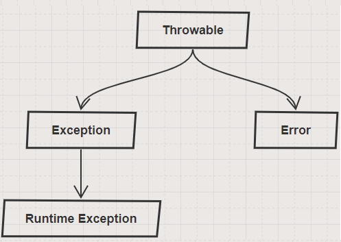

## Exception Handling

**Overview**
- An exception is disruption of intended flow of the program. When exception occurs system will terminate the program and display stack track of the cause of the error.
- Programmer can control this behavior using exceptional handling. All exceptions are child classes of *Throwable* class.
- Exceptions are categorized into three types
  - Checked:
    - These are identified by complier during compilation process and exception handling should be addressed by the programmers during creation of the code. Example `FileNotFoundException`.
  - Unchecked:
    - These cannot be identified by complier during compilation process and created only at runtime based on input provided. Example `ArithmeticException`, `ArrayIndexOutOfBoundsException`.
  - Error:
    - These are errors created during execution of code by JVM like `StackOverflowError`. These vary from environment and are not directly dependent on user inputs like Unchecked exceptions.

  
- Java exception handling is managed by five keywords `try`, `catch`, `finally` , `throw`  and `throws`. Below are different exception handling scenarios.
  - Basic: 
    - This example illustrates basic use of `try`, `catch`, `finally` , `throw`  and `throws`.
    ```java
    // Code without exception handling
    class Testing {
        public static void main (final String args[]){
            System.out.println("Result "+1/0);
        }
    }
    ```
    ```java
    class Testing {
        public static void main(final String args[]) {
            // Unchecked Exception
            try {
                FileInputStream file = new FileInputStream("");
                byte x = (byte) file.read();
                file.close();
            } catch (IOException e) {
                System.out.println("Invalid File");
                e.printStackTrace();
            } finally {
                System.out.println("Will be executed every time");
            }
        }
    }
    ```
    ```java
    class Testing {
        // Unchecked Exception
        public static void main (final String args[]){
            try{
                System.out.println("Result "+1/0);
            }catch(ArithmeticException e){
                System.out.println("Invalid expression");
                e.printStackTrace();
            } finally {
                System.out.println("Will be executed every time");
            }
        }
    }
    ```
    - We use `throws` keyword to indicate exception handling will be done by the calling class.
    ```java
    class Testing {
        // Calling object should handle IOException. In this case JVM will handle it.
        public static void main(final String args[]) throws IOException{
            FileInputStream file = new FileInputStream("");
            byte x = (byte) file.read();
        }
    }
    ```
    - We use `throw` keyword raise an exception.
    ```java
    class Testing {
        public static void main (final String args[]){
            System.out.println("Entered into Sample Code");
            throw new ArithmeticException();
        }
    }
    ```
  - Try with Resources:
    - During java programming, developers face code snippets that requires resources to be closed at end of try catch block. 
    - A new syntax has been introduced in Java 7 to automatically close the resource after execution. This eliminates use of finally block.
    ```java
    import java.io.FileInputStream;
    import java.io.IOException;

    class Testing {
        public static void main(final String args[]) {
            // Unchecked Exception
            try (FileInputStream file = new FileInputStream("")){
                byte x = (byte) file.read();
            } catch (IOException e) {
                System.out.println("Invalid File");
                e.printStackTrace();
            }
        }
    }
    ```
  - Userdefined:
    - Programer can create implementation specific exceptions to indicate specific root causes.
    ```java
    class StartException extends Exception {
        public StartException (){
            System.out.println("Entered into StartException");
        }
    }

    class EndException extends Exception {
        public EndException (){
            System.out.println("Entered into EndException");
        }
    }

    class Testing {
        public static void main (final String args[]){
            boolean start =true;
            try{
                System.out.println("Entered into Sample Code");
                if(start){
                    throw new StartException();
                }else{
                    throw new EndException();
                }
            }catch(StartException e){
                e.printStackTrace();
            }catch(EndException e){
                e.printStackTrace();
            }       
        }
    }
    ```
  - Multi Catch:
    - There are two approaches to support multiple catch blocks. One approach is given above and from Java 7 an additional support is added as given below.
    ```java
    package sample;

    class StartException extends Exception {
        public StartException (){
            System.out.println("Entered into StartException");
        }
    }

    class EndException extends Exception {
        public EndException (){
            System.out.println("Entered into EndException");
        }
    }

    class Testing {
        public static void main (final String args[]){
            boolean start =false;
            try{
                System.out.println("Entered into Sample Code");
                if(start){
                    throw new StartException();
                }else{
                    throw new EndException();
                }
            }catch(StartException | EndException e){
                e.printStackTrace();
            }     
        }
    }
    ```
  - Precise Rethrow:
    - This is also an additional feature added in Java 7. 
    - If there are multiple exception codes with similar catch execution like above,java allows to catch these exceptions using type Exception.
    - Compiler at runtime can determine the  exception type.
    ```java
    package sample;

    class StartException extends Exception {
        public StartException (){
            System.out.println("Entered into StartException");
        }
    }

    class EndException extends Exception {
        public EndException (){
            System.out.println("Entered into EndException");
        }
    }

    class Testing {
        public static void main (final String args[]){
            boolean start =true;
            try{
                System.out.println("Entered into Sample Code");
                if(start){
                    throw new StartException();
                }else{
                    throw new EndException();
                }
            }catch(Exception e){
                e.printStackTrace();
            }     
        }
    }
    ```
